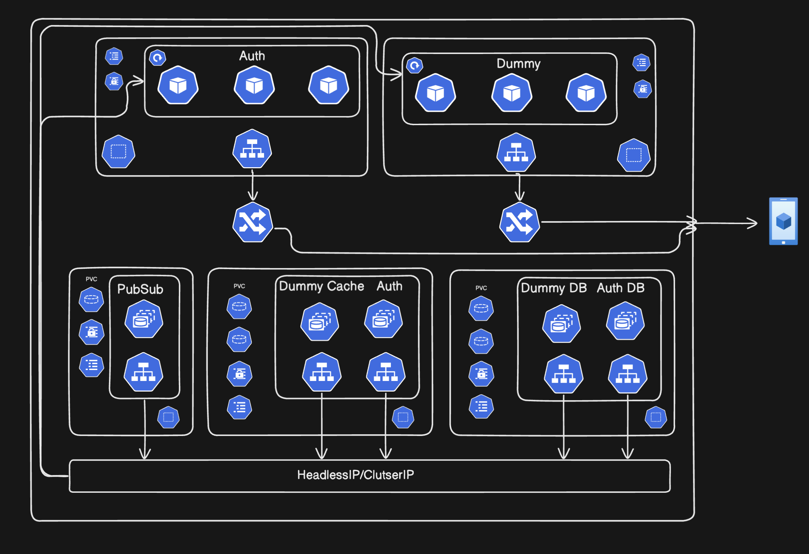

# 🚀 CI Pipeline for Monorepo

## Overview
This repository contains a robust Continuous Integration (CI) pipeline for a monorepo. The pipeline detects changes in microservices, builds and tests the code, sets up environments, and manages Docker containers efficiently.

## 📌 Workflow Triggers
The CI pipeline is triggered on:
- A push to the `main` branch.

## 🏗️ Jobs Overview
### 1️⃣ Detect Changes
- Checks out the repository.
- Detects which backend microservices have changed using Git.
- Outputs a JSON array of changed services for further processing.

### 2️⃣ Build & Test
- Checks out the repository.
- Sets up the Node.js environment (version 22).
- Installs dependencies, including `turbo`.
- Configures environment variables.
- Creates a Docker network if it doesn’t exist.
- Runs common Docker resources (like pub/sub services).
- Starts resource containers using `docker-compose.resources.yaml`.
- Verifies running containers and logs debug information if a failure occurs.
- Builds services using TurboRepo and runs in development mode.
- Waits until all services are up before running tests.
- Runs unit tests located in `/packages/test`.
- Cleans up Docker resources after testing.
- Builds Docker images for changed services.
- Deploys Docker containers using `docker-compose.yaml`.
- Runs a second round of verification, debugging, and testing.
- Formats detected services for Docker tagging.
- Logs in to Docker Hub.
- Tags and pushes images to Docker Hub with commit SHA.

## 🌐 Deployment
This project is deployed using **CIVO Cloud** and Kubernetes. The Kubernetes manifests for deployment can be found in the `infra/k8s` directory.

### Deployment Architecture


## 🛠️ Setup Instructions
### Environment Variables
Ensure you have the following secrets configured in GitHub Actions:
- `DOCKER_USERNAME`: Your Docker Hub username.
- `DOCKER_PASSWORD`: Your Docker Hub password.

### Required Scripts
- `scripts/start.sh`: Initializes the environment.
- `scripts/checkservice.sh`: Waits for all services to be up.
- `scripts/build_images.sh`: Builds Docker images.
- `scripts/tag_images.sh`: Tags and pushes Docker images.

## 🚀 Running the Pipeline Locally
To replicate the pipeline locally:
1. Clone the repository.
2. Run `npm install -g turbo && npm install`.
3. Create and start the necessary Docker resources:
   ```sh
   docker network create main_network || true
   docker compose -f 'docker/docker-compose.resources.yaml' up -d --build --wait
   ```
4. Run tests:
   ```sh
   cd packages/test
   npm run test
   ```
5. Build and deploy images:
   ```sh
   cd scripts/
   ./build_images.sh
   ./tag_images.sh <DOCKER_USERNAME> <GIT_SHA> <SERVICES_LIST>
   ```

## 📜 License
This project is licensed under the MIT License.

## 💡 Contributions
Feel free to open an issue or submit a pull request if you find any improvements!

